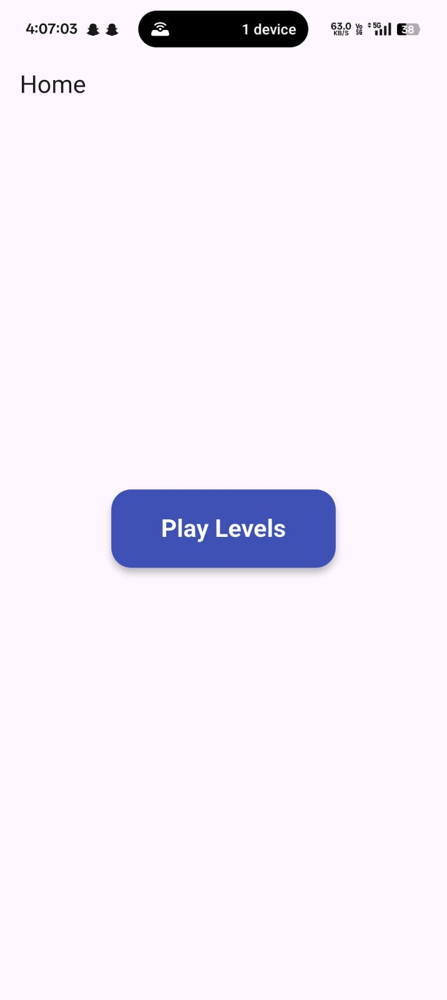
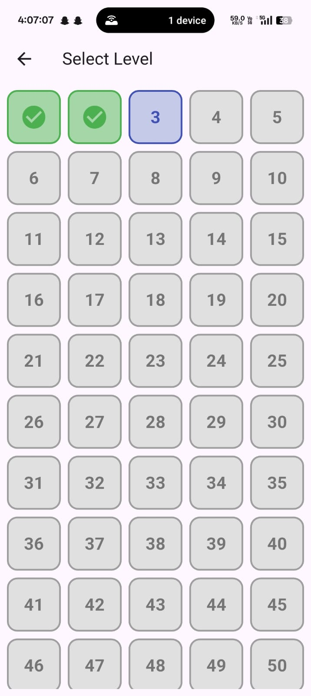
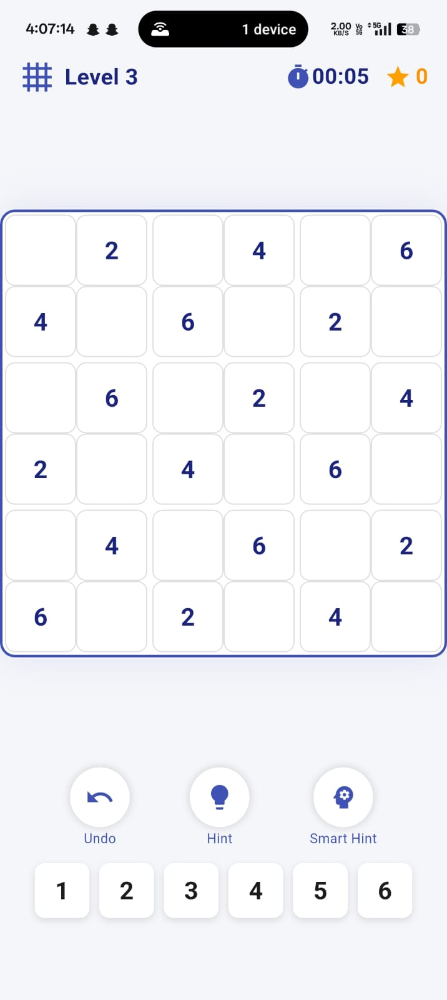
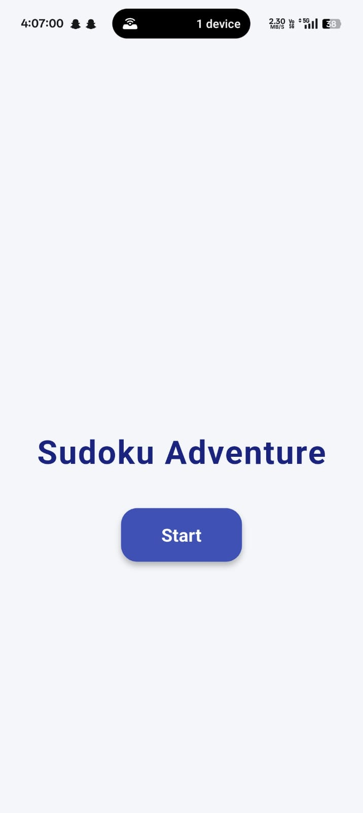

<p align="center">
  
</p>

# Sudoku Adventure

> A beautifully designed, feature-rich Sudoku puzzle game built with Flutter.

<p align="center">
  
  
</p>

---

## Table of Contents
- [Features](#features)
- [Screenshots](#screenshots)
- [Getting Started](#getting-started)
- [Folder Structure](#folder-structure)
- [Credits](#credits)
- [License](#license)

---

## Features
- 🎨 Elegant UI with animated transitions and splash screen
- 🧩 100 handcrafted levels (6x6 and 9x9 puzzles)
- 💡 Smart AI hints and logical step solver
- 🏆 Level progression and completion tracking
- 🔊 Sound effects and confetti celebration on win
- 📱 Responsive design for all devices
- 📢 Banner ads integration (Google Mobile Ads)
- 🎯 Adaptive launcher icons for Android & iOS

---

## Screenshots

<p align="center">
  
  
  
  
</p>

---

## Getting Started
1. **Clone the repository:**
   ```sh
   git clone https://github.com/krutpanda/sudoku.git
   cd sudoku
   ```
2. **Install dependencies:**
   ```sh
   flutter pub get
   ```
3. **Run the app:**
   ```sh
   flutter run
   ```
4. **Build APK:**
   ```sh
   flutter build apk --release
   ```

---

## Folder Structure
- `lib/` — Main Dart source code
- `assets/` — Images, icons, sounds, and animations
- `android/`, `ios/`, `web/`, `windows/`, `macos/`, `linux/` — Platform-specific code

---

## Credits
- Built with [Flutter](https://flutter.dev/)
- Lottie animations from [lottiefiles.com](https://lottiefiles.com/)
- Sudoku puzzles and logic by krut panada

---

## License
This project is licensed under the MIT License. See [LICENSE](LICENSE) for details.
